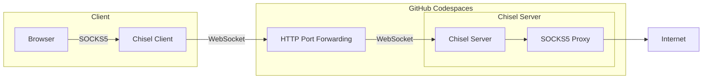
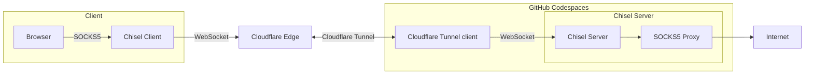

# SOCKS5 Proxy Codespaces
SOCKS5 Proxy hosted on GitHub Codespaces.

Proof of concept Chisel's SOCKS5 Proxy running on GitHub Codespaces.

## Usage
You need [Chisel](https://github.com/jpillora/chisel) installed since GitHub Codespaces only allows forwarding of HTTP protocol, and WebSocket can be used to tunnel SOCKS5 over HTTP.

1. Create a repository on GitHub using this template by clicking "Use this template" and then click "Create a new repository".
2. On your own repository, click Code, and click Codespaces tab.

### Via GitHub Codespaces HTTP port forwarding
3. Click "Create codespace on main".
4. Wait for the codespace to build.
5. After the codespace is built, a terminal will appear, don't do anything, wait for Chisel to run automatically.
6. When the text `server: Listening on http://0.0.0.0:8080` appeared, Chisel is now running.
7. Go to ports tab.
8. Right click port 8080, select "Port Visibility", then select "Public".
9. Copy the Local Address of port 8080.
10. On your computer, connect to your Chisel websocket by running `chisel client <your local address> socks`.
11. Connect your browser to Chisel's SOCKS5 proxy by setting proxy settings to `localhost:1080`.

### Via Cloudflare Tunnel
This method is shown to be faster in speed test than using GitHub Codespaces HTTP port forwarding.

3. Click the meatballs menu.
4. Click "New with options...".
5. Under the Dev container configuration dropbox, select "SOCKS5 Proxy Codespaces via cloudflared".
6. Wait for the codespace to build.
7. After the codespace is built, a terminal will appear, don't do anything, wait for Chisel and cloudflared to run automatically.
8. When the text `Your quick Tunnel has been created! Visit it at (it may take some time to be reachable):` appeared, Chisel and cloudflared is now running.
9. Under that text, there is an address like `https://<randomly-generated>.trycloudflare.com`, this is your address.
10. On your computer, connect to your Chisel websocket by running `chisel client <your address> socks`.
11. Connect your browser to Chisel's SOCKS5 proxy by setting proxy settings to `localhost:1080`.

Don't forget to gracefully shut down the proxy by pressing Ctrl+C and to delete the codespace after usage.

## Change region
You can change your IP address geolocation by selecting a region on the dropbox when using "New with options...".

## Speed tests
### GitHub Codespaces HTTP port forwarding

### Cloudflare Tunnel

