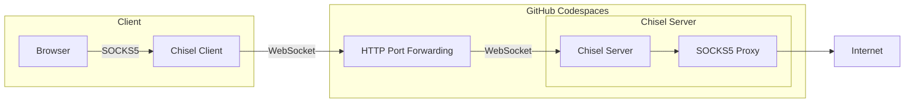

# SOCKS5 Proxy Codespaces
SOCKS5 Proxy hosted on GitHub Codespaces.

Proof of concept Chisel's SOCKS5 Proxy running on GitHub Codespaces.

## Usage
You need [Chisel](https://github.com/jpillora/chisel) installed since GitHub Codespaces only allows forwarding of HTTP protocol, and WebSocket can be used to tunnel SOCKS5 over HTTP.

1. Create a repository on GitHub using this template by clicking "Use this template" and then click "Create a new repository".
2. On your own repository, click Code, and click Codespaces tab.
3. Click "Create codespace on main".
4. Wait for the codespace to build.
5. After the codespace is built, a terminal will appear, don't do anything, wait for Chisel to run automatically.
6. When the text `server: Listening on http://0.0.0.0:8080` appeared, Chisel is now running.
7. Go to ports tab.
8. Right click port 8080, select "Port Visibility", then select "Public".
9. Copy the Local Address of port 8080.
10. On your computer, connect to your Chisel websocket by running `chisel client <your local address> socks`.
11. Connect your browser to Chisel's SOCKS5 proxy by setting proxy settings to `localhost:1080`.

## Speed tests
### GitHub Codespaces HTTP Port Forwarding

### Cloudflare Tunnel
